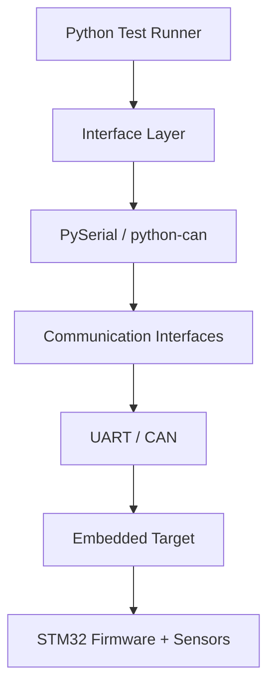

# STM32 Hardware Validation Framework

Python-based validation environment for testing embedded hardware interfaces.

This project demonstrates how Python automation can interact with embedded systems through **UART and CAN communication**, enabling automated device validation similar to workflows used in hardware test and firmware validation environments.

---

## Architecture



The test runner executes validation scripts which interact with embedded devices through Python interface modules.

---

## Project Structure

```
src/
  framework/
    uart.py
    can_interface.py
  test_runner.py

tests/
  test_uart.py
  test_can.py

docs/
  documentation
```

### src/framework

Contains communication interface modules used to interact with hardware devices.

### tests

Contains validation scripts executed by the test runner.

### docs

Additional documentation and design notes.

---

## Running Tests

Install dependencies:

```
pip install pyserial python-can
```

Run the test runner:

```
python src/test_runner.py
```

The test runner automatically discovers and executes test files located in the `tests/` directory.

---

## Example Test Flow

1. Python test script sends a command to the device over UART  
2. STM32 firmware processes the command  
3. Device returns response data to the host system  
4. Python validation logic verifies expected results  
5. Test outcome is logged and reported  

---

## Example Output

```
Running test_uart
UART test starting
Device response: OK

Running test_can
CAN test starting
Received: <CAN message>

Test summary
2 tests passed
0 tests failed
```

---

## Key Capabilities

- UART communication using **PySerial**
- CAN messaging using **python-can**
- Modular Python interface layer
- Automated test discovery and execution
- Minimal framework for embedded validation workflows

---

## Future Improvements

- STM32 command protocol integration
- Sensor validation (BME280)
- Structured test artifacts (JSON / CSV reports)
- Integration with lab instruments
- Continuous test logging

---

## License

MIT License
