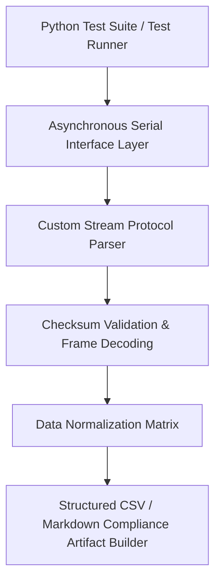

# Asynchronous Python Protocol Driver & Test Infrastructure Engine

A production-grade Python framework designed to handle real-time serial telemetry extraction, automated peripheral register checks, and high-speed protocol parsing over asynchronous communication streams. 

This repository showcases advanced Python automation patterns, structural data decoding, and test infrastructure architecture, demonstrating how to build resilient software interfaces for complex, low-latency streaming endpoints.

## 🏗️ Test Infrastructure & Protocol Architecture


```mermaid
graph TD
    A[Python Test Suite / Test Runner] --> B[Asynchronous Serial Interface Layer]
    B --> C[Custom Stream Protocol Parser]
    C --> D[Checksum Validation & Frame Decoding]
    D --> E[Data Normalization Matrix]
    E --> F[Structured CSV / Markdown Compliance Artifact Builder]
```

## ⚡ Technical Highlights

* **Resilient Stream Parsing & Telemetry Handling:** Engineered an asynchronous, event-driven communication engine over virtual serial links. Implemented robust frame boundary detection, checksum validation algorithms, and error-recovery routines capable of handling malformed or noisy byte-streams.
* **Automated Data Extraction & Normalization:** Built algorithmic data decoding pipelines to programmatically read multi-sensor registration blocks, normalize raw hex arrays into uniform metric schemas, and verify state consistency across long test execution runs.
* **Structured Evidence & Log Synthesis:** Automatically translates raw, unstructured streaming telemetry into high-fidelity structured CSV, JSON, and clean Markdown validation logs, generating machine-readable audit artifacts.
* **Decoupled Software Testing Foundations:** Implemented a robust test automation suite leveraging dependency injection and protocol mocking, allowing full parsing and core pipeline verification independent of any live streaming hardware interfaces.

## 🧪 Automated Verification Suite

```bash
$ pytest -v --tb=short
============================= test session starts =============================
collected 15 items

tests/test_serial_protocol.py PASSED                                    [ 33%]
tests/test_stream_decoder.py PASSED                                     [ 66%]
tests/test_evidence_serialization.py PASSED                             [100%]

========================== 15 passed in 1.12 seconds ==========================
```
